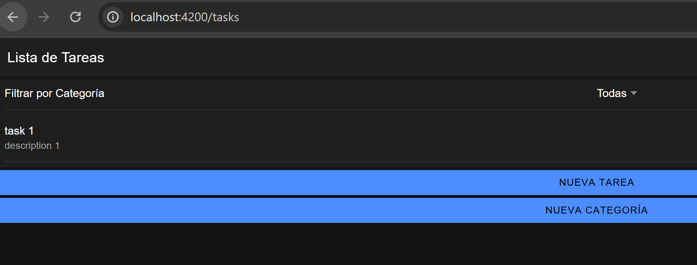
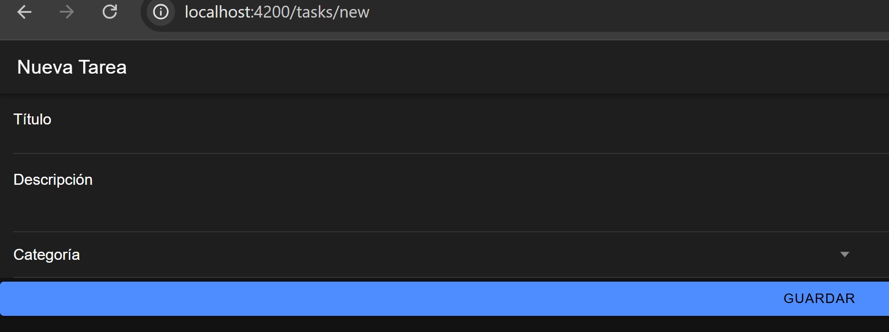
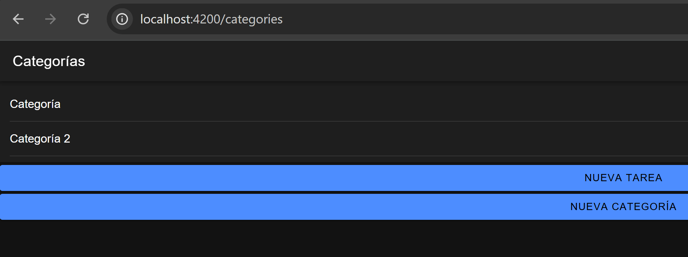
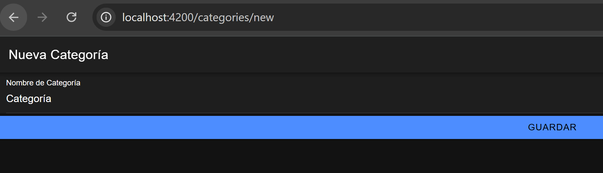

# Ionic To-Do App with Categories  

## Descripción del Proyecto  
Este proyecto es una aplicación de lista de tareas (To-Do List) construida con **Ionic** y **Angular**. Permite a los usuarios:  

1. **Gestionar Tareas:**   
   - Crear, editar y eliminar tareas.   
   - Asignar categorías a cada tarea.   
   - Filtrar tareas por categoría. 
       
2. **Gestionar Categorías:**      
   - Crear, editar y eliminar categorías.
    
3. **Experiencia de Usuario Mejorada:**   
   - Interfaz sencilla y amigable.     
   - Compatible con plataformas móviles (Android e iOS).  

---

## Funcionalidades  

### Gestión de Tareas  
- **CRUD completo**: Los usuarios pueden añadir, actualizar y eliminar tareas.  
- **Categorías**: Las tareas se pueden asignar a categorías específicas.  
- **Filtro por Categoría**: Posibilidad de mostrar solo las tareas de una categoría específica.  

### Gestión de Categorías  
- **CRUD completo**: Crear, editar y eliminar categorías.  
- **Relación con Tareas**: Las categorías están integradas directamente con el sistema de tareas.  

---

## Instalación y Configuración  

Sigue estos pasos para levantar el proyecto:  

### 1. Requisitos Previos  
Asegurar de tener instalado:  
- [Node.js](https://nodejs.org/) (versión 14 o superior).  
- [Ionic CLI](https://ionicframework.com/docs/cli) (instalar con `npm install -g @ionic/cli`).  

### 2. Clonar el Proyecto  
```bash
git clone https://github.com/tu-repo/ionic-todo-app.git  
cd ionic-todo-app
```

### 3. Instalar Dependencias 
```bash  
npm install  
```

### 4. Ejecutar la Aplicación
```bash  
ionic serve    
```
o

```bash  
yarn start
```

--- 

## Compilación para Dispositivos
### Android
#### 1. Configura un entorno de desarrollo Android con Android Studio.

#### 2. Compila el proyecto:
```bash  
ionic cordova build android --release
```

### iOS
#### 1. Configura un entorno de desarrollo iOS con Xcode.

#### 2. Compila el proyecto:
```bash  
ionic cordova build ios --release
```
---

## Rutas Disponibles

La aplicación tiene varias rutas que permiten a los usuarios navegar entre las páginas principales y realizar acciones en las tareas y categorías. Aquí están las rutas disponibles:

### **1. Página de Inicio**
- **Ruta:** `/`
- **Descripción:** Página principal de la aplicación.

### **2. Página de Lista de Tareas**
- **Ruta:** `/tasks`
- **Descripción:** Muestra todas las tareas existentes. Permite editar, eliminar y filtrar las tareas por categoría.


### **3. Crear Nueva Tarea**
- **Ruta:** `/tasks/new`
- **Descripción:** Página donde los usuarios pueden crear una nueva tarea. Aquí se asigna un título, descripción y categoría a la tarea.


### **5. Página de Lista de Categorías**
- **Ruta:** `/categories`
- **Descripción:** Muestra todas las categorías existentes. Desde aquí, los usuarios pueden gestionar las categorías, como crear, editar y eliminar.


### **6. Crear Nueva Categoría**
- **Ruta:** `/categories/new`
- **Descripción:** Página donde los usuarios pueden crear una nueva categoría. Se proporciona un formulario para agregar el nombre de la categoría.



---


## Respuestas a Preguntas de Documentación

#### 1. ¿Cuáles fueron los principales desafíos que enfrentaste al implementar las nuevas funcionalidades?
- Gestión de Dependencias: Integrar diferentes servicios como categorías y tareas manteniendo un diseño limpio fue un reto.
- Actualización Dinámica: Sincronizar las tareas con las categorías de forma reactiva requirió diseñar correctamente los flujos de datos con RxJS.

#### 2. ¿Qué técnicas de optimización de rendimiento aplicaste y por qué?
- Uso de BehaviorSubject: Para manejar los estados de tareas y categorías, se utilizo BehaviorSubject, asegurando actualizaciones eficientes sin recalcular innecesariamente.
- Pipes de RxJS: Se uso combineLatest y map para filtrar tareas dinámicamente sin afectar el rendimiento.
Carga Dinámica de Componentes: Solo se carga las partes necesarias, reduciendo el tiempo de renderizado en dispositivos móviles.
#### 3. ¿Cómo aseguraste la calidad y mantenibilidad del código?
- Modularidad: Se dividio las funcionalidades en componentes y servicios independientes.
- Buenas Prácticas de Angular: Se uso NgModules para organizar el código y mantener un diseño escalable.
- Documentación y Comentarios: Cada servicio y componente tiene comentarios claros que explican su propósito. Además se probó cada funcionalidad para garantizar su correcto funcionamiento.

